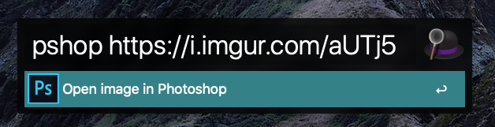

# alfred-workflow-photoshop-url

Alfred 4.0 workflow which takes the URL of an image and then opens it in Adobe Photoshop

## Dependencies

Requires Adobe Photoshop

## Installation

1. Download and import the [photoshop-url.alfredworkflow](https://github.com/mattstratton/alfred-workflow-photoshop-url/blob/master/photoshop-url.alfredworkflow) workflow file
1. Set the `download` variable for your preferred directory for the files to be downloaded. For example, `/Users/mattstratton/Downloads`

## Usage

`pshop ${URL_TO_IMAGE}`

```
pshop https://i.imgur.com/aUTj56q.png
```


